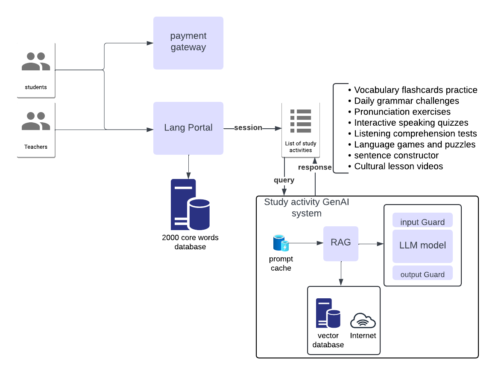

## Technical Considerations

 This is high level diagram that is used to communicate to key stakeholders the business solution we are implementing.
 

## Architectural/Design Considerations
    - Requirements, Risks, Assumptions, & Constraints:
        - Requirements: Using GenAi to create a language leaning app to learn Arabic.
        - Risks: The user might not get the expected out he wants from the modle or a fully right answer.
        - Constraints: The system and the tools used needs to be in free tier and open source due to tight budget.

    - Data Strategy: data will be collected from books and audio that our organization owns to avoid any copy rights issues. we will also we scrap any resources that are free for the public use on the interner.
    - Model Selection and Development: we will use Llama 3 because Llama 3 is an open-source model, and Meta made the model's code and weights publicly available, allowing developers to access and build upon the technology.
    - Infrastructure Design: we will use self hosted servers, as after doing some calculation this will be much cheaper than using a cloud provider, and we don't expect alot of trafic, so we won't need an high availability. 

## Business Considerations
    - Use Cases:
      This model will be used to help the student learn Arabic language on the lang portal, by interacting with then throught various activites like:
        - sencence constructions
        - Vocabulary flashcards practice 
        - Daily grammar challenges

    - Complexity: Adding a GenAI model will add complexity to the following:
        - we will need to invest in our Infrastructure
        - the app will need to know how to interact with the model
        - feedback and monotoring to the model prompts is necessary to finetune it and improve it's efficency.

    - Key levers of cost: 
        - we will need to have an AI expert to help us finetune our model.
        - we will need to invest in our infrastrucure to host the model locally.

